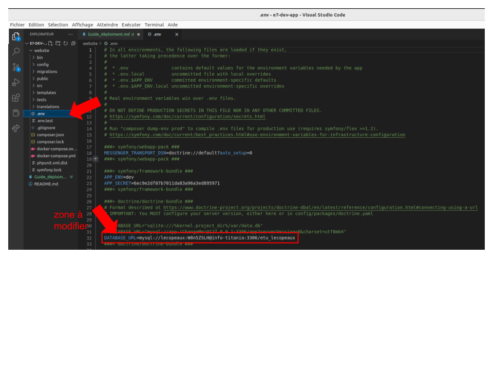

# Guide de déploiment 

## 1. Préparer l'environnement de production 

Assurez-vous que le serveur de production dispose des __dernières mises à jour__, des extensions PHP nécessaires.

## 2. Installer Symfony

Pour faire fonctionner le site, vous devez d'abord __installer symfony__. Pour cela entrer dans votre terminal la commande: 

```bash
curl -sS https://get.symfony.com/cli/installer | bash
```

Ensuite, ajoutez ce dossier dans votre __$PATH__, en ajoutant dans le fichier __.bashrc__:
```bash
export PATH=$PATH:$HOME/symfony
```

## 3. Configurer le __Vhost__

Configurez un __VirtualHost__ pour votre application Symfony dans votre serveur web (par exemple Apache ou Nginx) pour assurer que les requêtes sont dirigées vers le bon répertoire de votre application.

## 4. Cloner le dépôt

Utilisez __GitLab__ pour cloner le dépôt de votre application sur le serveur de production avec cette commande:

```bash
# en ssh
git clone git@gitlab-ce.iut.u-bordeaux.fr:lecopeaux/e7-dev-app.git
# ou en html
git clone https://gitlab-ce.iut.u-bordeaux.fr/lecopeaux/e7-dev-app.git
```

## 5. Installer les dépendances 

Utilisez __Composer__ pour installer les dépendances de votre application dans le répertoire de votre application en utilisant la commande: 

```bash
symfony composer install
```

## 6. Configurer l'accès à la base de données 

Configurez les paramètres de connexion à la base de données de production dans le fichier __.env__ de votre application.
comme ici:


## 7. Mettre à jour la base de données

Mettez à jour la base de données en exécutant à partir du répertoire de votre application la commande : 

```bash
php bin/console doctrine:schema:update --force 
```

## 8. Configurer les droits d'accès

Configurez les droits d'accès pour les répertoires de votre application pour assurer que le serveur web a les permissions nécessaires pour lire et écrire les fichiers.

> Conseil : Redémarrez votre serveur web pour appliquer les modifications de configuration.

## 9. Tester l'application

Testez votre application en accédant à l'URL de votre __VirtualHost__ pour vous assurer qu'elle fonctionne correctement.